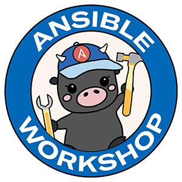

# One Time Setup

Here are the setup directions you have to perform one time for the [workshop provisioner](../provisioner).

# Table Of Contents

<!-- TOC titleSize:2 tabSpaces:2 depthFrom:1 depthTo:6 withLinks:1 updateOnSave:1 orderedList:0 skip:0 title:1 charForUnorderedList:* -->
## Table of Contents
* [One Time Setup](#one-time-setup)
* [Table Of Contents](#table-of-contents)
  * [1. Create an Amazon AWS account.](#1-create-an-amazon-aws-account)
  * [2. Create an Access Key ID and Secret Access Key.](#2-create-an-access-key-id-and-secret-access-key)
  * [3. Install the following packages](#3-install-the-following-packages)
    * [Workshop specific packages](#workshop-specific-packages)
    * [Network Workshop](#network-workshop)
    * [Windows Workshop](#windows-workshop)
  * [4. Set your Access Key ID and Secret Access Key](#4-set-your-access-key-id-and-secret-access-key)
  * [5. Clone the workshops repo:](#5-clone-the-workshops-repo)
  * [6. Run the requirements.yml file to ensure all the Ansible collection prerequisites are met.](#6-run-the-requirementsyml-file-to-ensure-all-the-ansible-collection-prerequisites-are-met)
  * [7.  Subscribe to AWS marketplace images](#7--subscribe-to-aws-marketplace-images)
  * [8. One time setup Complete](#8-one-time-setup-complete)
* [Automation controller Instructions](#automation-controller-instructions)
  * [Getting Help](#getting-help)
<!-- /TOC -->

## 1. Create an Amazon AWS account.

- Go to the [AWS Article](https://aws.amazon.com/premiumsupport/knowledge-center/create-and-activate-aws-account/) if you need help on opening an AWS account.

## 2. Create an Access Key ID and Secret Access Key.  

  - New to AWS and not sure what this step means?  [Click here](aws-directions/AWSHELP.md)
  - Save the ID and key for later.

## 3. Install the following packages


| package  | `dnf`   | `pip`  |
|---|---|---|
| [git](https://git.kernel.org/pub/scm/git/git.git) | `git` | N/A |
| [ansible-core](https://docs.ansible.com/core.html) 2.11 or newer | `ansible-core` | `ansible-core` |
| [boto3](https://aws.amazon.com/sdk-for-python/) - required for `amazon.aws` collection | `python3-boto3` | `boto3` |
| [netaddr](https://netaddr.readthedocs.io/en/latest/)| `python3-netaddr` | `netaddr` |
| [passlib](https://passlib.readthedocs.io/en/stable/) | `python3-passlib` | `passlib`
| [Requests](https://docs.python-requests.org/en/latest/)| `python3-requests` | `requests` |

Example installation with dnf:
`dnf install python3-boto`

Example installation with pip (recommended to use a virtualenv):
`python3 -m pip install boto3`

### Workshop specific packages

### Network Workshop

For the network workshop you must also install paramiko version 2.8.1

| package  | `dnf`   | `pip`  |
|---|---|---|
| [paramiko](https://www.paramiko.org/) | `python3-paramiko` | `paramiko==2.8.1` |

```
python3 -m pip install paramiko==2.8.1
```

Recommended to use `pip` for this package since we don't have exchaustive test list of every OS and what paramiko version ships with it.

Why paramiko 2.8.1?  See issue: [76737](https://github.com/ansible/ansible/issues/76737).  Paramiko will be replaced by `libssh` in the future.

### Windows Workshop

The windows workshops will also require pywinrm and requests-credssp

| package  | `dnf`   | `pip`  |
|---|---|---|
| [pywinrm](https://github.com/diyan/pywinrm)| `python3-winrm` | `pywinrm`
| [requests-credssp](https://pypi.org/project/requests-credssp/)| `python3-requests-credssp` | `requests-credssp` |


  **Are you using Automation Controller (formerly Ansible Tower)?**  [Automation Controller Instructions](#controller-instructions)

## 4. Set your Access Key ID and Secret Access Key

The access key and secret access key that you created from Step 2 should be stored under `~/.aws/credentials`

```
[root@centos ~]# cat ~/.aws/credentials
[default]
aws_access_key_id = ABCDEFGHIJKLMNOP
aws_secret_access_key = ABCDEFGHIJKLMNOP/ABCDEFGHIJKLMNOP
```

## 5. Clone the workshops repo:

If you haven't done so already make sure you have the repo cloned to the machine executing the playbook

        git clone https://github.com/ansible/workshops.git
        cd workshops/

## 6. Run the requirements.yml file to ensure all the Ansible collection prerequisites are met.

```
ansible-galaxy collection install -r collections/requirements.yml
```

## 7.  Subscribe to AWS marketplace images

Some of the workshops require specific images provided via the AWS marketplace:

  - For Networking you will need the Cisco CSR (Cloud Services Router) [Click here](https://aws.amazon.com/marketplace/pp/B00NF48FI2/), the Arista CloudEOS Router (PAYG) [Click here](https://aws.amazon.com/marketplace/pp/prodview-v5qiohwjlngay), **AND** the Juniper vSRX NextGen Firewall [Click here](https://aws.amazon.com/marketplace/pp/B01LYWCGDX/)
  - For F5 you will need the F5 BIG-IP [Click here](https://aws.amazon.com/marketplace/pp/B079C44MFH/)
  - For the security workshop the [Check Point CloudGuard Security Management](https://aws.amazon.com/marketplace/pp/B07KSBV1MM?qid=1613741711380&sr=0-2&ref_=srh_res_product_title) and the [Check Point CloudGuard Network Security](https://aws.amazon.com/marketplace/pp/B07LB3YN9P?ref_=aws-mp-console-subscription-detail-byol)

## 8. One time setup Complete

[Return to workshop provisioner instructions](../provisioner)

# Automation controller Instructions

**NOTE** Sean needs to update this for Execution Environments (EE), the plan is to automatically create an EE that will spin up workshops with all requirements built-in.

Are you using Red Hat Ansible Automation Controller to provision Ansible Automation Workshops? (e.g. is your control node Ansible Automation Controller?)  Make sure to use umask for the installation of boto3 on the control node.
https://docs.ansible.com/ansible-tower/latest/html/upgrade-migration-guide/virtualenv.html

```
[user@centos ~]$ sudo -i
[root@centos ~]# source /var/lib/awx/venv/ansible/bin/activate
[root@centos ~]# umask 0022
[root@centos ~]# dnf install -y python3-boto3
[root@centos ~]# deactivate
```

## Getting Help

**Please [file issues on Github](https://github.com/ansible/workshops/issues).**  Please fill out all required information.  Your issue will be closed if you skip required information in the Github issues template.


