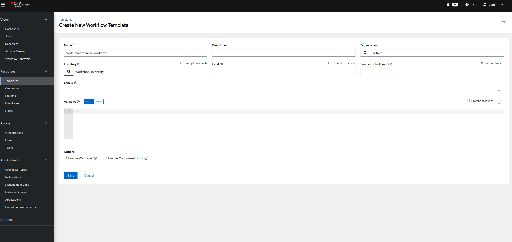

# Exercise 4.3: Creating Node Maintenance Workflow

**Read this in other languages**:  [English](README.md),   [日本語](README.ja.md).

## Table of Contents

- [Objective](#objective)
- [Guide](#guide)
- [Takeaways](#takeaways)
- [Complete](#complete)

# Objective

Demonstrate another use case of [Ansible Automation Controller workflow](https://docs.ansible.com/automation-controller/latest/html/userguide/workflows.html) for F5 BIG-IP.

For this exercise, we will create a workflow for server patch management, first to disable the pool members, patch the nodes, and then enable the nodes. In parallel, we also attach an iRule to virtual server, to respond to the users when servers are under maintenance.

# Guide

## Step 1: Prepare Job Templates

Similar to the previous lab, we need to create the following templates by following `Lab 4.1`:

| NAME | Playbook |
|---|---|
| Disable node | disable_node.yml |
| Enable node | enable_node.yml |
| Patch server | patch_server.yml |
| Attach iRule | attach_irule.yml |
| Detach iRule | detach_irule.yml |
|

Again, we use the same template parameters as `Lab 4.1` for each of the above templates, except for `Patch server`. This template will use credential `Workshop Credential`, and  all other templates will be using `BIGIP`

| Parameter | Value |
|---|---|
| NAME  | |
| JOB TYPE | Run |
| INVENTORY | Workshop Inventory |
| PROJECT | Workshop Project |
| PLAYBOOK | |
| CREDENTIALS | |
|

Here is one example templates configured:

## Step 2: Create a Workflow Template

1. Click on the **Templates** link on the left menu.

2. Click on the  button. Select the **Workflow Template**.

3. Fill out the form as follows:

   | Parameter | Value |
   |---|---|
   | NAME | Node maintenance workflow |
   | ORGANIZATION | Default |
   | INVENTORY | Workshop Inventory |
   |

   

4. Click on the **Save** button

## Step 3: The Workflow Visualizer

1. When you click the **SAVE** button, the **WORKFLOW VISUALIZER** should automatically open. If not click on the blue **WORKFLOW VISUALIZER** button.

2. By default only a green **START** button will appear. Click on the **START** button.

3. The **ADD A NODE** window will appear on the right.

## Step 4: Disable node Template

1. Select the **Disable node** Job Template. Use the drop down box to select run. Select **Always** from left navigator menu option called **Run type**.
2. Click the **Save** button.

   

## Step 5: Attach iRule Template

1. Click on the **START** button, again. The **ADD A NODE** will appear again.

2. Select the **Attach iRule** job template. Select **Always** from left navigator menu option called **Run type**.

3. Click the **Save** button.

   

## Step 6: Patch server Template

1. Hover over the **Disable node** node and click the  **+** symbol. The **ADD A NODE** will appear again.

2. Select the **Patch server** job template. Select **On Success** from left navigator menu option called **Run type**.

3. Click the **Save** button.

   

## Step 7: Enable node Template

1. Hover over the **Patch server** node and click the  **+** symbol.  The **ADD A NODE** will appear again.

2. Select the **Enable node** job template.  Select **On Success** from left navigator menu option called **Run type**.

3. Click the **Save** button.

   

## Step 8: Detach iRule Template

1. Hover over the **Enable node** node and click the **+** symbol. The **ADD A NODE** will appear again.

2. Select the **Detach iRule** job template. Select **On Success** from left navigator menu option called **Run type**.

3. Click the **Save** button.

   

## Step 9: Create a converged link

Lastly, we create a convergence link, which allows the jobs running in parallel to converge. In another word, when both jobs finish, `Detach iRule` node will trigger.

1. Hover over the `Attach iRule to virtual server` node and click the chain symbol.

2. Now, click on the existing `Detach iRule`. An ADD LINK window will appear. For the RUN parameter choose Always.

   

3. Click the **SAVE** button again to save the workflow.

## Step 10: Run the Workflow

1. Return to the **Templates** window

2. Click the launch button to launch the **Node maintenance workflow** template.

   

   At any time during the workflow job you can select an individual job template by clicking on the node to see the status.

3. With the iRule attached to virtual server, users will receive a maintenance page during the server maintenance:

   

# Takeaways

You have

- Created a workflow template that disables pool members, upgrade web servers, and add servers back to the pool
- Attached iRule to virtual server, and user will get maintenance page during server patch
- Launched the workflow template and explored the **VISUALIZER**

# Complete

You have completed lab exercise 4.3

[Click here to return to the Ansible Network Automation Workshop](../README.md)
