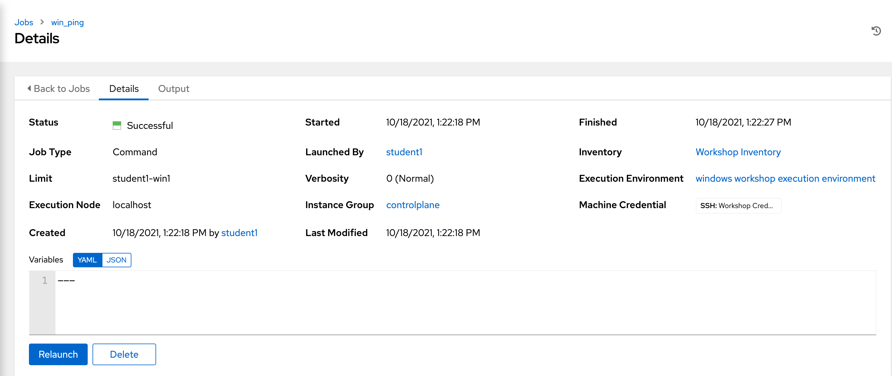
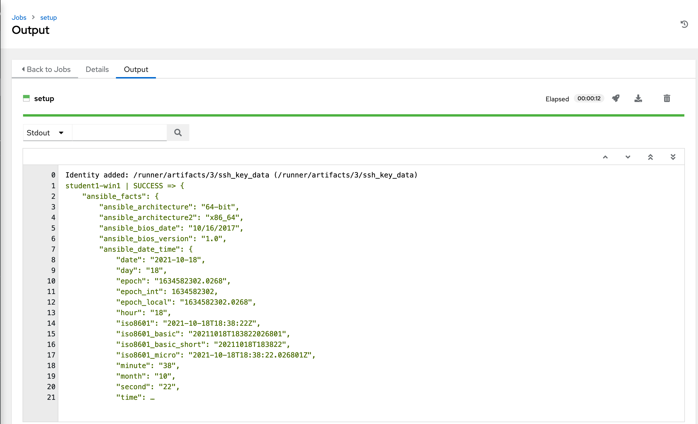
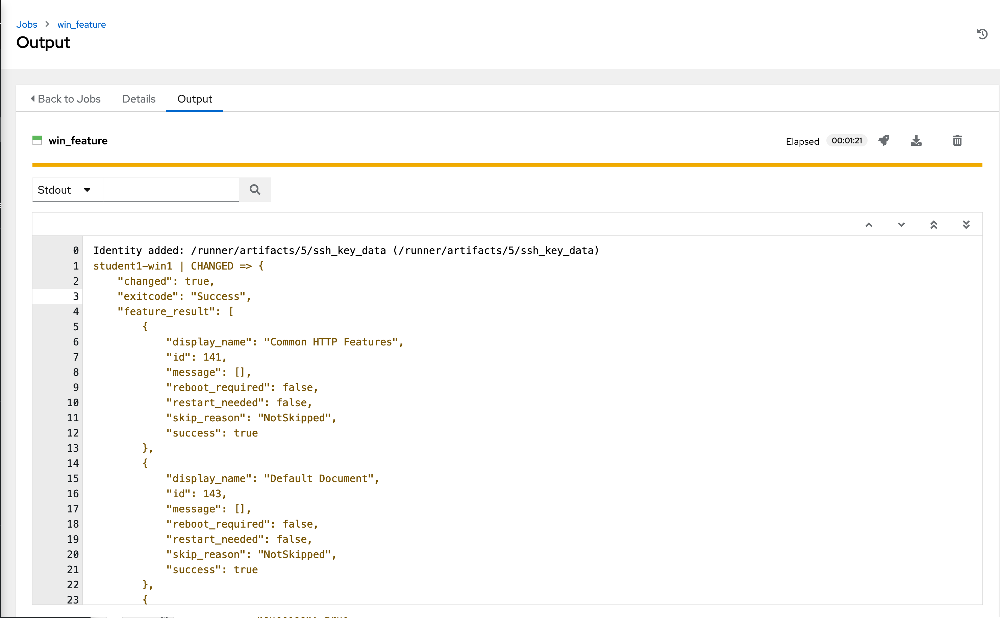

セクション 1: アドホックコマンド
==============================================

**他の言語でもお読みいただけます**:
  [English](README.md),  [日本語](README.ja.md),  [Français](README.fr.md).
 

最初の演習では、Ansible の動作の感じをつかむために、いくつかアドホックコマンドを実行します。Ansible Ad-Hoc
コマンドでは、playbook を使わずにリモートノードでタスクを実行できます。これらは、1 つまたは 2
つのことを素早く多くのリモートノードに行う必要がある場合に便利です。

ステップ 1
--------------

まず、インベントリーに移動する必要があります。したがって、左側のパネルの **Inventories** をクリックしてから、インベントリーの
**Workshop Inventory** の名前をクリックします。Inventory Details
ページが表示されたため、ホストを選択する必要があります。したがって、**HOSTS** をクリックします。

各ホストの横には、チェックボックスがあります。アドホックコマンドを実行したい各ホストの横にあるチェックボックスにチェックを入れます。**Run
Command** ボタンを選択します。

これにより、**Execute Command** ウィンドウがポップアップ表示されます。ここから、ホストに対して単一のタスクを実行できます。

まずは基本的なことから始めましょう。ホストに ping を実行します。`win_ping` モジュールは、Windows
ホストが応答することを確認します。これは従来の *ping* ではありませんが、実際にはホストへの接続と認証の両方を検証します。

このフォームに次のように記入してください

| Key                   | Value                                  | Note                                                           |
| --------------------- | -------------------------------------- | -------------------------------------------------------------- |
| Module                | `win_ping`                             |                                                                |
| Arguments             |                                        | Intentionally blank                                            |
| Limit                 |                                        | This should display the host you selected in the previous step |

**NEXT** ボタンをクリックします。

| Key                   | Value                                  | Note |
| --------------------- | -------------------------------------- | ---- |
| Execution environment | windows workshop execution environment |      |

**NEXT** ボタンをクリックします。

| Key                | Value               | Note |
| ------------------ | ------------------- | ---- |
| Machine credential | Workshop Credential |      |
|                    |                     |      |

**LAUNCH** をクリックすると、ジョブログにリダイレクトされます。Automation Controller
のすべてのジョブとアクションは記録され、保存されます。これらのログは、Splunk や ELK
などの他のログシステムに自動的にエクスポートすることもできます。

出力タブはデフォルトで表示されます。タスクによって生成された出力が表示されます。

詳細タブには、タスクがいつ、誰によって、どのような認証情報で実行され、どのホストが影響を受けたかという情報が表示されます。

返される結果は、使用するモジュールによって異なります。これらはすべて、タスクに応じて異なるデータセットを処理および処理するためです。どのモジュールを使用する場合でも、SUCCESS、FAILURE、CHANGED、または
SKIPPING のいずれかの色分けされたステータスが常に表示されます。

ステップ 2
--------------

次に、PowerShell コマンドを実行し、`win_shell` モジュールを使用して出力を表示する方法を見てみましょう。

もう 1 度フォームに入力しましょう。ただし、今回は `win_shell` モジュールを使用して `Get-Service` Powershell
コマンドを実行します。

| Key       | Value         | Note                                                           |
| --------- | ------------- | -------------------------------------------------------------- |
| Module    | `win_shell`   |                                                                |
| Arguments | `Get-Service` |                                                                |
| Limit     |               | This should display the host you selected in the previous step |

**NEXT** ボタンをクリックします。

| Key                   | Value                                  | Note |
| --------------------- | -------------------------------------- | ---- |
| Execution environment | windows workshop execution environment |      |

**NEXT** ボタンをクリックします。

| Key                | Value               | Note |
| ------------------ | ------------------- | ---- |
| Machine credential | Workshop Credential |      |
|                    |                     |      |

ジョブを起動し、結果を表示します。Powershell コマンドが返したものの直接出力が返されることがわかります。このデータは変数に保存でき、後で
Ansible Playbook 内で直接解析できます。

そして、`Get-Process` Powershell コマンドを使用してもう 1 度実行します。

| Key       | Value         | Note                                                           |
| --------- | ------------- | -------------------------------------------------------------- |
| Module    | `win_shell`   |                                                                |
| Arguments | `Get-Process` |                                                                |
| Limit     |               | This should display the host you selected in the previous step |

**NEXT** ボタンをクリックします。

| Key                   | Value                                  | Note |
| --------------------- | -------------------------------------- | ---- |
| Execution environment | windows workshop execution environment |      |

**NEXT** ボタンをクリックします。

| Key                | Value               | Note |
| ------------------ | ------------------- | ---- |
| Machine credential | Workshop Credential |      |
|                    |                     |      |

ステップ 3
--------------

ここからは、Windows ノードの構成を見ていきます。`setup` モジュールは、リモートホストにさまざまなデータを照会し、そのデータを
Ansible
ファクトとして返します。このデータは、オペレーティングシステムのバージョンやハードウェアの構成などを確認するのに役立ちます。これをプレイブックで利用することで、タスクを実行するかどうかを判断したり、OS
のバージョンに応じてパッケージの名前を決定したりすることができます。

`setup` モジュールは、設定されていない限り、すべてのプレイブックの先頭で自動的に実行されるため、このデータは常に Playbook
で利用できます。

先に進み、`setup` モジュールを実行して出力を確認しましょう。**EXECUTE COMMAND** フォームにこの情報をもう一度入力します。

| Key       | Value   | Note                                                           |
| --------- | ------- | -------------------------------------------------------------- |
| Module    | `setup` |                                                                |
| Arguments |         | Intentionally blank                                            |
| Limit     |         | This should display the host you selected in the previous step |

**NEXT** ボタンをクリックします。

| Key                   | Value                                  | Note |
| --------------------- | -------------------------------------- | ---- |
| Execution environment | windows workshop execution environment |      |

**NEXT** ボタンをクリックします。

| Key                | Value               | Note |
| ------------------ | ------------------- | ---- |
| Machine credential | Workshop Credential |      |
|                    |                     |      |

以下のような出力が表示されるはずです。

(**注意:** 上記の出力の 21 行目に示されている 3 つのドットをクリックすると、`setup`
モジュールによって返されるすべてのファクトが表示されます。)

ステップ 4
--------------

それでは、`win_feature` モジュールを使用して IIS をインストールしましょう。引数パラメーターはもう少し複雑になります。

| Key       | Value                           | Note                                                           |
| --------- | ------------------------------- | -------------------------------------------------------------- |
| Module    | `win_feature`                   |                                                                |
| Arguments | `name=Web-Server state=present` |                                                                |
| Limit     |                                 | This should display the host you selected in the previous step |

**NEXT** ボタンをクリックします。

| Key                   | Value                                  | Note |
| --------------------- | -------------------------------------- | ---- |
| Execution environment | windows workshop execution environment |      |

**NEXT** ボタンをクリックします。

| Key                | Value               | Note |
| ------------------ | ------------------- | ---- |
| Machine credential | Workshop Credential |      |

ログテキストがオレンジ色になっていることがわかります。これは、システムに変更が加えられたことを示しています。一方、グリーンは以前に変更が行われていないことを示しています。

ステップ 5
--------------

さて、IIS がインストールされたので、`win_service` モジュールを使用して開始されていることを確認しましょう。

| Key       | Value                      | Note                                                           |
| --------- | -------------------------- | -------------------------------------------------------------- |
| Module    | `win_service`              |                                                                |
| Arguments | `name=W3Svc state=started` |                                                                |
| Limit     |                            | This should display the host you selected in the previous step |

**NEXT** ボタンをクリックします。

| Key                   | Value                                  | Note |
| --------------------- | -------------------------------------- | ---- |
| Execution environment | windows workshop execution environment |      |

**NEXT** ボタンをクリックします。

| Key                | Value               | Note |
| ------------------ | ------------------- | ---- |
| Machine credential | Workshop Credential |      |

ステップ 6
--------------

最後に、クリーンアップを行います。まず、IIS サービスを停止します。

| Key       | Value                      | Note                                                           |
| --------- | -------------------------- | -------------------------------------------------------------- |
| Module    | `win_service`              |                                                                |
| Arguments | `name=W3Svc state=stopped` |                                                                |
| Limit     |                            | This should display the host you selected in the previous step |

**NEXT** ボタンをクリックします。

| Key                   | Value                                  | Note |
| --------------------- | -------------------------------------- | ---- |
| Execution environment | windows workshop execution environment |      |

**NEXT** ボタンをクリックします。

| Key                | Value               | Note |
| ------------------ | ------------------- | ---- |
| Machine credential | Workshop Credential |      |
|                    |                     |      |

ステップ 7
--------------

次に、IIS 機能を削除します。

| Key       | Value                          | Note                                                           |
| --------- | ------------------------------ | -------------------------------------------------------------- |
| Module    | `win_feature`                  |                                                                |
| Arguments | `name=Web-Server state=absent` |                                                                |
| Limit     |                                | This should display the host you selected in the previous step |

**NEXT** ボタンをクリックします。

| Key                   | Value                                  | Note |
| --------------------- | -------------------------------------- | ---- |
| Execution environment | windows workshop execution environment |      |

**NEXT** ボタンをクリックします。

| Key                | Value               | Note |
| ------------------ | ------------------- | ---- |
| Machine credential | Workshop Credential |      |
|                    |                     |      |

そして、ホストを再起動します。

| Key       | Value        | Note                                                           |
| --------- | ------------ | -------------------------------------------------------------- |
| Module    | `win_reboot` |                                                                |
| Arguments |              | Intentionally blank                                            |
| Limit     |              | This should display the host you selected in the previous step |

**NEXT** ボタンをクリックします。

| Key                   | Value                                  | Note |
| --------------------- | -------------------------------------- | ---- |
| Execution environment | windows workshop execution environment |      |

**NEXT** ボタンをクリックします。

| Key                | Value               | Note |
| ------------------ | ------------------- | ---- |
| Machine credential | Workshop Credential |      |
|                    |                     |      |

> **注意**
>
> `win_reboot` モジュールはマシンを再起動させ、その後
> 終了する前に、完全に元に戻るのを待ちます。この場合、
> Playbook の途中でホストを再起動する必要があり、Playbook の残りは、
> ホストにアクセスできないため、失敗しません。

結果
------

アドホックコマンドは、時折実行すると便利な場合があります。ただし、自動化が環境内で成長し続けるにつれて、自動化の使用頻度はますます少なくなっています。上記の
IIS の例では、面倒な一連のアドホックコマンドを介して実行するのではなく、Playbook
に書き出すことができたはずです。このアドホックコマンドとの相互作用は、CLI
からの個々のコマンドの実行を模倣しているように見えます。追加の演習で、これがより明確になります。

*お気づきでしょうか。*タスクが Windows サーバーで実行される場合、Ansible は、そのタスクの実行後に再起動が必要かどうかをスマートに認識しています。以下は、IIS 機能を削除するコマンドの出力の一部です。このタスクの出力は、続行する前に再起動するかどうかなど、後続のタスクで使用できます。

  
[Click here to return to the Ansible for Windows Workshop](../README.md)
